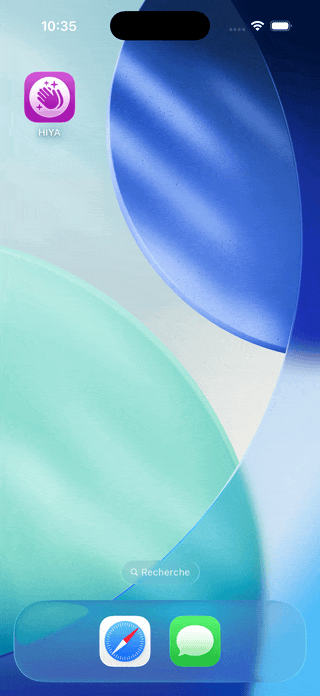

# 👋 HIYA

Une app iOS qui utilise Apple Intelligence (on-device LLM) pour générer des salutations créatives et fun, directement sur l'appareil.


## 📱 Aperçu

<div align="center">
  
  <p><em>Génération de salutations avec Apple Intelligence</em></p>
</div>

## ✨ Fonctionnalités

- 🤖 **On-device AI** — Utilise le LLM local d'Apple via `FoundationModels`, aucune donnée envoyée sur internet
- ⚡ **Réponses instantanées** — Génération de texte directement sur l'appareil
- 🎨 **UI élégante** — Glass effect, animations et design soigné
- 🔄 **Gestion d'états** — Loading, empty state et réponse affichés proprement
- 📵 **Gestion des indisponibilités** — Messages clairs si Apple Intelligence n'est pas activé ou si l'appareil n'est pas éligible

## 🛠️ Technologies utilisées

| Technologie | Utilisation |
|-------------|-------------|
| Swift 6 | Langage de programmation |
| SwiftUI | Framework UI déclaratif |
| FoundationModels | Framework Apple Intelligence (LLM on-device) |
| SystemLanguageModel | Accès au modèle de langage local |
| LanguageModelSession | Session de génération de texte |

## 🏗️ Architecture

```
HIYA/
└── ContentView.swift    # Vue principale + logique IA
```

### Flux de données

```
┌─────────────────────────────────────────────────────┐
│  SystemLanguageModel.default                        │
│  → Vérifie la disponibilité d'Apple Intelligence    │
└─────────────────────────────────────────────────────┘
                        │
                        ▼
┌─────────────────────────────────────────────────────┐
│  LanguageModelSession                               │
│  → Envoie le prompt au LLM local                   │
│  → Retourne la réponse générée                      │
└─────────────────────────────────────────────────────┘
                        │
                        ▼
┌─────────────────────────────────────────────────────┐
│  ContentView                                        │
│  → Affiche loading / empty state / réponse          │
│  → Gère les cas d'indisponibilité du modèle         │
└─────────────────────────────────────────────────────┘
```

## 📚 Concepts SwiftUI appliqués

| Concept | Utilisation |
|---------|-------------|
| `FoundationModels` | Framework Apple Intelligence |
| `SystemLanguageModel.availability` | Vérification de la disponibilité du LLM |
| `LanguageModelSession` | Session de génération de texte |
| `async/await` | Requête asynchrone au modèle |
| `defer` | Garantit la remise à `false` de `isLoading` quoi qu'il arrive |
| `ContentUnavailableView` | Empty state élégant |
| `.symbolEffect(.pulse)` | Animation sur le SF Symbol |
| `.glassEffect()` | Effet verre sur le bouton |
| `switch` sur enum | Gestion des cas d'indisponibilité du modèle |

## 💡 Point clé : `defer`

```swift
Task {
    defer { isLoading = false } // Toujours exécuté à la fin, quoi qu'il arrive

    isLoading = true

    let prompt = "Say hi in a fun way."
    do {
        let replay = try await session.respond(to: prompt)
        response = replay.content
    } catch {
        response = "Failed to get response: \(error.localizedDescription)"
    }
}
```

`defer` garantit que `isLoading` sera toujours remis à `false`, que la requête réussisse, échoue ou soit annulée.

## ⚙️ Prérequis

- iPhone ou iPad compatible Apple Intelligence
- iOS 18.4+
- Apple Intelligence activé dans les Réglages

## 🚀 Installation

```bash
git clone https://github.com/votre-username/HIYA.git
cd HIYA
open HIYA.xcodeproj
```

## 📈 Améliorations possibles

- [ ] Permettre à l'utilisateur de choisir le type de salutation (formel, fun, poétique...)
- [ ] Historique des salutations générées avec SwiftData
- [ ] Partager la salutation générée
- [ ] Streaming de la réponse caractère par caractère
- [ ] Support multilingue du prompt

## 👤 Auteur

**Guillaume Richard**

## 📚 Ressources

- [FoundationModels Documentation](https://developer.apple.com/documentation/foundationmodels)
  
---

**⭐ Si ce projet vous a été utile, n'hésitez pas à lui donner une étoile !**
